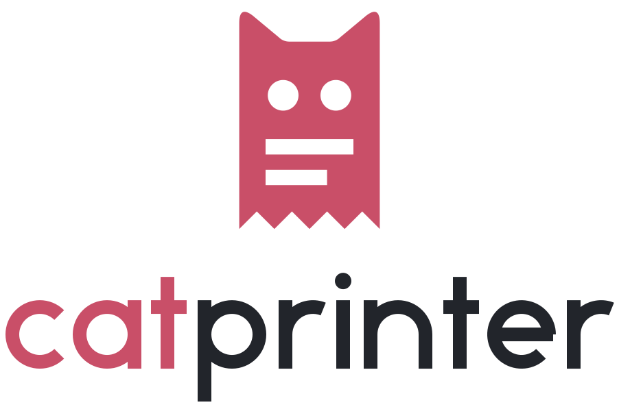

# Cat Printer logo

A till receipt whose top edge turns into cat ears: **cat** and **printer** in one
shape. The two lines are printed text, the zigzag bottom is the tear-off edge.

  
  &nbsp;&nbsp;
  
  &nbsp;&nbsp;
  

## Files

| File | Use |
|---|---|
| `catprinter-horizontal.svg` | Main logo: symbol + wordmark side by side (light backgrounds) |
| `catprinter-horizontal-on-dark.svg` | Same for dark backgrounds |
| `catprinter-stacked*.svg` | Symbol above the wordmark, for square-ish spaces |
| `catprinter-symbol*.svg` | Symbol alone (≥ 48 px) |
| `catprinter-symbol-small*.svg` | Small cut for 16–47 px: bigger eyes, one print line, coarser teeth |
| `catprinter-wordmark*.svg` | Wordmark alone |
| `catprinter-app-icon.svg`, `-small.svg`, `-512.png` | White symbol on a rose tile (app/avatar) |
| `social-preview.png` | 1280 × 640 image for *GitHub → Settings → Social preview* |
| `make_logo.py` | Regenerates all SVGs |

Suffixes: none = colour, `-black` = one colour dark, `-white` = one colour for
dark or photo backgrounds, `-on-dark` = colour version for dark backgrounds.

The tray icon and `packaging/CatPrinter.ico` are drawn from the same shapes by
`catprinter/logo.py`; the status page embeds the symbol as inline SVG.

## Colours

| | HEX | RGB |
|---|---|---|
| **Rose** (symbol, “cat”) | `#C94F68` | 201 79 104 |
| **Ink** (“printer”, one-colour version) | `#22252B` | 34 37 43 |
| White | `#FFFFFF` | 255 255 255 |

Rose is the accent colour of the status page as well.

## Wordmark

`catprinter` is set in constructed geometric lowercase letters (uniform
stroke, circular bowls), drawn as paths – no font is needed or licensed. In
the colour version “cat” is rose and “printer” ink (white on dark).

## Rules

- **Clear space:** at least the width of one ear (¼ of the symbol width) on every side.
- **Minimum size:** symbol 16 px (use the small cut below 48 px); horizontal logo 120 px wide.
- **Backgrounds:** colour version on white or light grey; `-on-dark` / `-white` on dark.
- **Don't** stretch, rotate, recolour the parts individually, add shadows or
  outlines, or rebuild the wordmark in another font.
